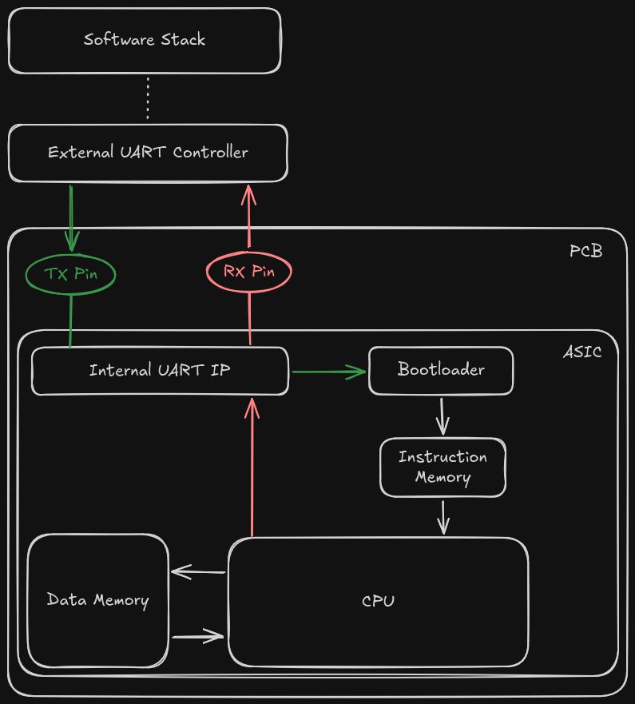

# Architecture

An `8-bit` cpu along with a bootloader and IO capability - all combined into one design



# ISA

## Supported instructions

```
instruction || 7:7 | 6:5  | 4:4   | 3:0      || elaboration
==========================================================================
add         || 0   | 00   | x     | x        || register_a = reg_a + reg_b
--------------------------------------------------------------------------
add 1       || 0   | 01   | x     | x        || reg_a = reg_a + 1
--------------------------------------------------------------------------
and         || 0   | 10   | x     | x        || reg_a = reg_a & reg_b
--------------------------------------------------------------------------
not         || 0   | 11   | x     | x        || reg_a = ~reg_a
--------------------------------------------------------------------------
jmp         || 1   | 00   | x     | address  || program_counter = address
--------------------------------------------------------------------------
store       || 1   | 01   | x     | address  || data_mem[address] = reg_a
--------------------------------------------------------------------------
load        || 1   | 10   | x     | address  || reg_b = data_mem[address]
--------------------------------------------------------------------------
nop         || 1   | 11   | x     | x        || 
```

# Simulate

Install project dependencies

> if no venv/

```
python3 -m venv venv
```

> If venv/ exists:

```
. ./venv/bin/activate
```

> Then install simulation dependencies

```
chmod a+x *.sh
./install.sh
```

> Run simulation
```
make test
```

# Emulate

> Follow the [`README.md` in `emulate/`](./emulate/) to build the FPGA environment and emulate `tcpu` on FPGA