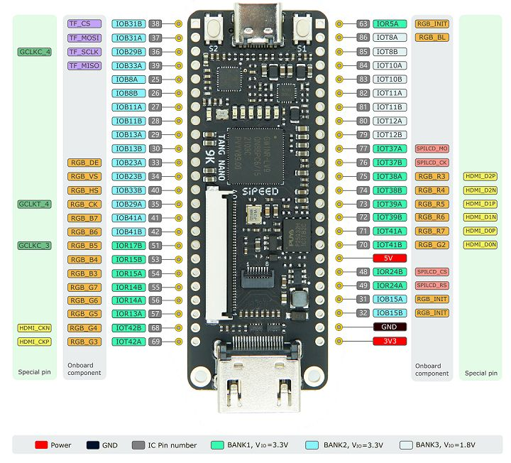

# Testing `tcpu` on FPGA

We will use the `Tangnano9K` to emulate the `tcpu`



## Install FPGA toolchain in Linux

> install `openFPGALoader`:
```
cd /home/$USER/tcpu/emulate/
chmod a+x *.sh
./install_ofpgal.sh
```

> [!IMPORTANT]
> Follow the [readme here](https://github.com/matchahack/think.like_a_chip/tree/main/0_GETTING_STARTED) to get the docker image for building bitstreams

## Build and load the `tcpu` onto the T9K

> run docker (terminal 0):
```
make docker_up
```

> build in docker, and flash bitstream to fpga (terminal 1):
```
make docker_build
make fpga_flash
```

## Read cell/gate usage summary

> Calculate the synthesizer output for memory and logic elements (terminal 1):
```
make read_gls
```

## Run program on emulator

You will need a `USBC` to `UART` converter to program this CPU. [This is how to make your own](https://github.com/matchahack/usbc2uart.up). Or just buy a cheap one online.

> [!IMPORTANT]
Plug in the `USBC2UART` converter, and use `ls /devttyUSB*` to find out which interface to use for programming.

## How to test

Plug in the `USBC2UART` and connect the `TX`/`RX`/`GND` wires correctly, then program the CPU with a list of instructions:

> Program the CPU with a list of instructions (terminal 1):

```
chmod a+x *.sh
python programmer.py -p /dev/ttyUSB0 -b 115200 -i "[0x20, 0x20, 0x20, 0x20, 0x20, 0x20, 0x20, 0x20]"
python programmer.py -p /dev/ttyUSB0 -b 115200 -i "[0xC0, 0x20, 0xA0, 0xC0, 0xFF, 0xFF, 0xFF, 0xFF]"
python programmer.py -p /dev/ttyUSB0 -b 115200 -i "[0x60, 0x20, 0x60, 0xFF, 0xFF, 0xFF, 0xFF, 0xFF]"
```